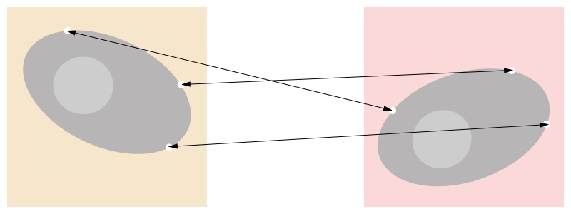
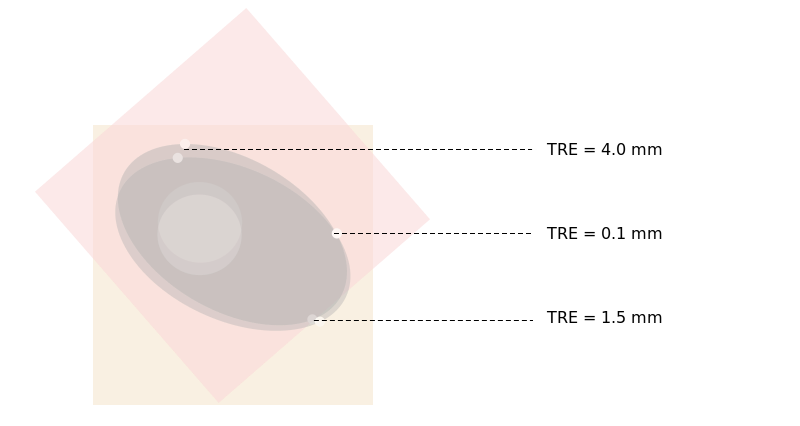

# Estimating Fiducial Localization Error Using Simulations

## Image Registration

Image registration is the process of transforming two or more images into the same coordinate system.

For example, we may want to register:

- a high-resolution CT of a patient, used to plan radiation therapy
- a low-resolution cone-beam CT of the immobilized patient, taken from within the [linac](https://en.wikipedia.org/wiki/Linear_particle_accelerator).

Registering these images will ensure that the patient's position within the planning CT coordinate system is known and can be adjusted.  Registration errors will result in misalignments going uncorrected, and less effective radiation therapy because healthy tissue will be irradiated instead of the tumor.

There are many types of registration problems, for example:

- registering a series of CTs taken of the same patient
- registering a set of images from different patients
- registering an MRI with a CT
- registering a 2D x-ray projection with a 3D CT.

There are also many types of transformations one use, for example:

- rigid (i.e., translation and rotation)
- affine (i.e., translation, rotation, reflections, and scaling)
- constrained non-rigid.

See references [^1] and [^2] for more general categorizations of registration problems.

## Point-Based Registration Algorithms

A common class of registration algorithms works by locating and matching a set of features in each image, and then finding the rigid transformation that co-aligns these features.

The most commonly used features are points, and frequently, these points are objects that are placed into the image in order to simplify the registration process.

Once the points have been located and matched, frequently we minimize the root mean square distances between the pairs of match points in order to find the optimal transformation.  However, other approaches for deducing the transformation may be preferable, depending on the application.

## Fiducial Localization Error (FLE) and Registration Error

For many applications it is necessary to know how "well" a registration algorithm is likely to perform on a particular problem.  Quantifying performance is complicated because:

1. Performance may vary dramatically based on the particular images
2. Registration accuracy cannot be easily reduced to a single number because it is spatially varying.

A given algorithm may perform well on a subset of images, but perform poorly in general.  Frequently algorithms which are implemented in an academic environment are over-fit to their test datasets; generalizing these algorithms usually requires extra work, even though the initial results lead one to believe the algorithm is nearly complete.

The target registration error (TRE) is the distance between corresponding points in two images, after the registration transformation has been applied.  The TRE is usually spatially varying.  Depending on the problem, we may reduce the TRE to its mean or maximum value within a ROI in the image.

Note that in order to measure the TRE, we need to have a gold standard registration to compare our algorithm's registration against.  Frequently this gold standard is produced using visual inspection or simulations.

## Factors that Affect FLE

## Using a Simulator to Estimate FLE

## Reece Results

## Dillon Results

## Zach Results

## Willy Results

## Conclusions

## References

[^1]: **Medical Image Registration,** *Physics in Medicine and Biology,* **46** R1-R45, June 2000, Derek L. G. Hill, et. al.

A readable review of registration problems and algorithms.  It uses a simple notation and stays high-level for the most part.  The introductory sections 1 - 4 are highly recommended, as is is the section that discusses registration accuracy (section 11).

> Radiological images are increasingly being used in healthcare and medical research. There is, consequently, widespread interest in accurately relating information in the different images for diagnosis, treatment and basic science. This article reviews registration techniques used to solve this problem, and describes the wide variety of applications to which these techniques are applied. Applications of image registration include combining images of the same subject from different modalities, aligning temporal sequences of images to compensate for motion of the subject between scans, image guidance during interventions and aligning images from multiple subjects in cohort studies. Current registration algorithms can, in many cases, automatically register images that are related by a rigid body transformation (i.e. where tissue deformation can be ignored). There has also been substantial progress in non-rigid registration algorithms that can compensate for tissue deformation, or align images from different subjects. Nevertheless many registration problems remain unsolved, and this is likely to continue to be an active field of research in the future.

[^2]: **An Overview of Medical Image Registration Methods,** August 1998, J. B. Antoine Maintz and Max A. Viegever.

This review presents an exhaustive categorization of registration methods.  It is less detailed than [^1].  Here is the abstract:

> The purpose of this paper is to present an overview of existing medical registration methods.  These methods will be classified according to a model based on nine salient criteria, the main dichotomy of which is *extrinsic* versus *intrinsic* methods.  The statistics of the classification show definite trends in the evolving registration techniques, which will be discussed.  At this moment, the bulk of interesting intrinsic methods is either based on segmented points or surfaces, or on techniques endeavoring to use the full information content of the images involved.

[^3]: The fiducial localization article for particle tracking
